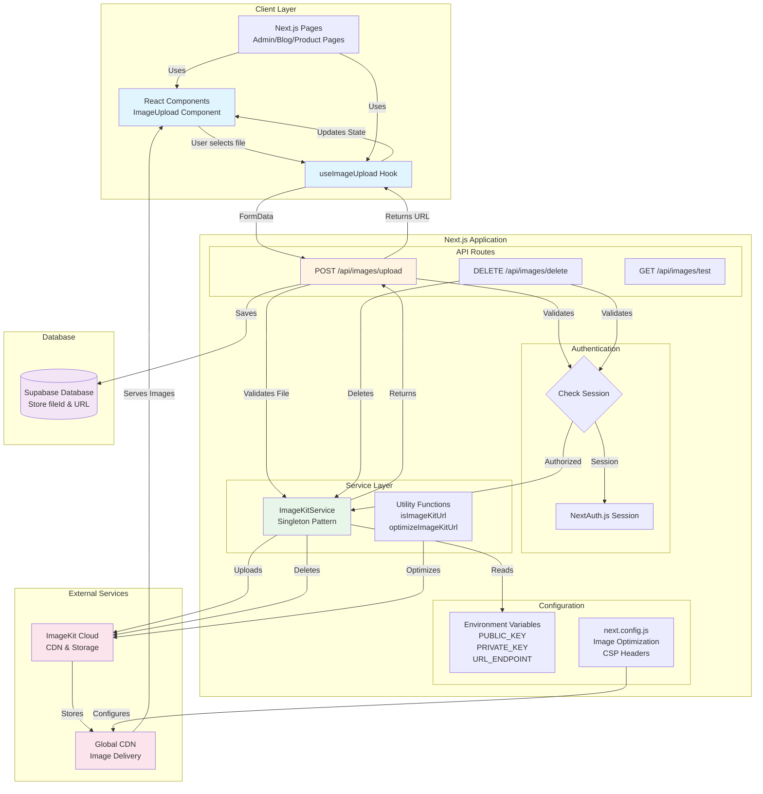
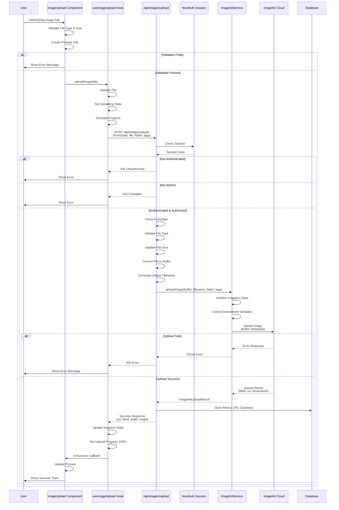
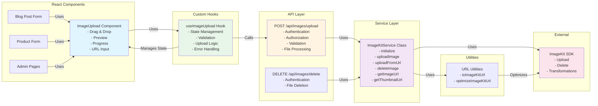
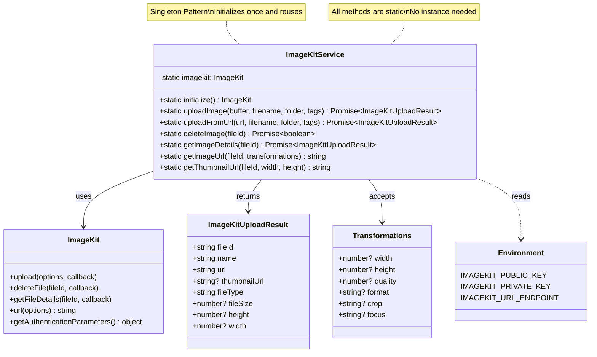
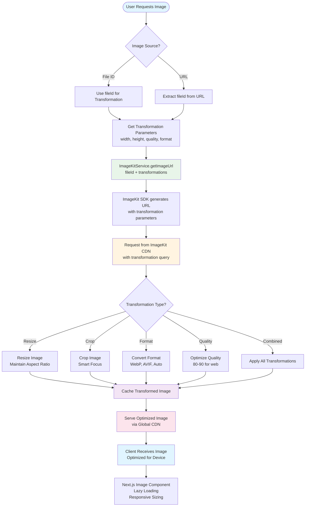
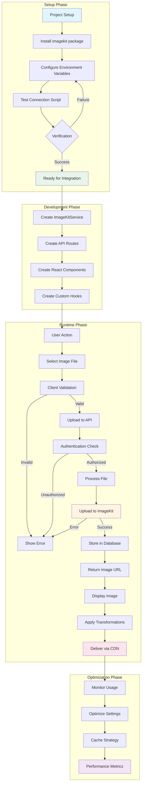
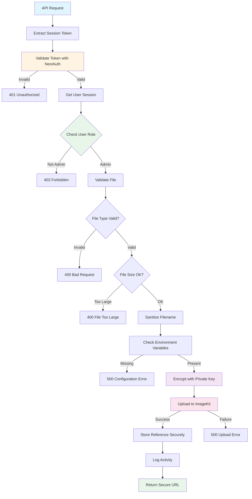
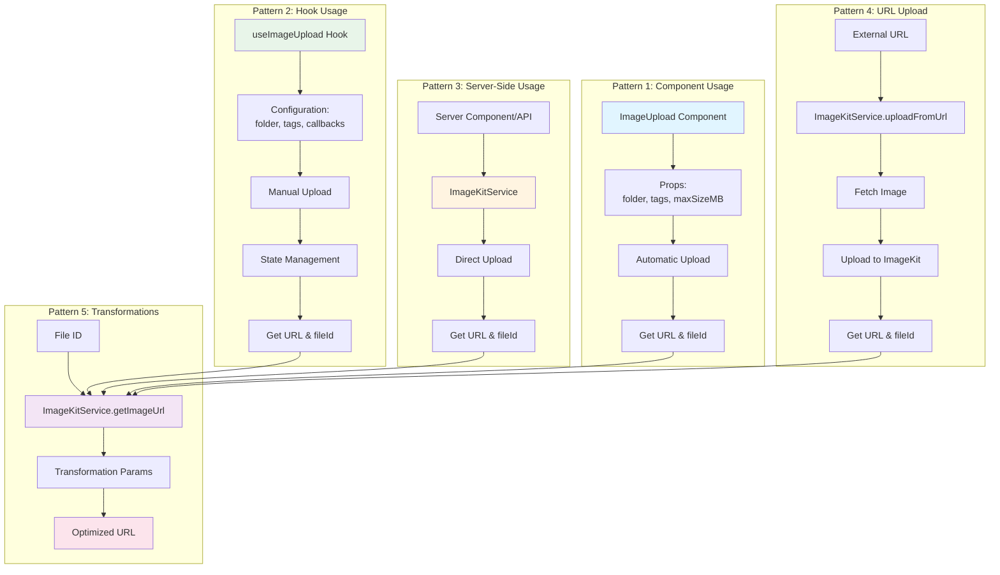

# ImageKit Integration Architecture Diagrams

This document contains comprehensive Mermaid diagrams illustrating the ImageKit integration architecture, data flow, and component relationships in Next.js applications.

## Table of Contents

1. [System Architecture Overview](#system-architecture-overview)
2. [Image Upload Flow](#image-upload-flow)
3. [Component Relationship Diagram](#component-relationship-diagram)
4. [Service Layer Architecture](#service-layer-architecture)
5. [Image Transformation Flow](#image-transformation-flow)

---

## System Architecture Overview

This diagram shows the high-level architecture of the ImageKit integration:



---

## Image Upload Flow

This diagram illustrates the complete image upload process from user interaction to ImageKit storage:



---

## Component Relationship Diagram

This diagram shows how React components, hooks, and services interact:



---

## Service Layer Architecture

This diagram details the ImageKitService class structure and methods:



---

## Image Transformation Flow

This diagram shows how image transformations work with ImageKit:



---

## Complete Integration Flow

This comprehensive diagram shows the end-to-end flow from setup to image delivery:



---

## Data Flow Diagram

This diagram shows the data flow through the entire system:

```mermaid
flowchart LR
    subgraph "Input"
        File[Image File<br/>JPEG, PNG, WebP, GIF]
        Metadata[Metadata<br/>folder, tags, filename]
    end

    subgraph "Client Processing"
        File --> Validate[Validate<br/>Type & Size]
        Validate --> FormData[Create FormData]
        Metadata --> FormData
        FormData --> API[Send to API]
    end

    subgraph "Server Processing"
        API --> Auth[Authenticate User]
        Auth --> Parse[Parse FormData]
        Parse --> ServerValidate[Server Validation]
        ServerValidate --> Convert[Convert to Buffer]
        Convert --> GenerateName[Generate Unique Name]
        GenerateName --> Service[ImageKitService]
    end

    subgraph "ImageKit Service"
        Service --> Init[Initialize Client]
        Init --> Upload[Upload Image]
        Upload --> ImageKitAPI[ImageKit API]
    end

    subgraph "ImageKit Cloud"
        ImageKitAPI --> Store[Store Image]
        Store --> Process[Process & Optimize]
        Process --> CDN[CDN Distribution]
    end

    subgraph "Response"
        CDN --> Response[Return Response<br/>fileId, url, dimensions]
        Response --> DB[(Database<br/>Store Reference)]
        Response --> Client[Return to Client]
    end

    subgraph "Client Display"
        Client --> State[Update State]
        State --> Preview[Show Preview]
        Preview --> Transform[Apply Transformations]
        Transform --> Display[Display Image]
    end

    style File fill:#e1f5ff
    style Service fill:#e8f5e9
    style ImageKitAPI fill:#fff4e1
    style CDN fill:#fce4ec
    style Display fill:#f3e5f5
```

---

## Security & Authentication Flow

This diagram illustrates the security layers in the ImageKit integration:



---

## Usage Examples Flow

This diagram shows different usage patterns:



---

## Summary

These diagrams provide a comprehensive visual representation of:

1. **System Architecture**: High-level overview of all components
2. **Upload Flow**: Step-by-step upload process
3. **Component Relationships**: How React components interact
4. **Service Layer**: Detailed service class structure
5. **Transformation Flow**: How image transformations work
6. **Integration Flow**: End-to-end integration process
7. **Data Flow**: How data moves through the system
8. **Security Flow**: Authentication and authorization layers
9. **Usage Patterns**: Different ways to use the integration

Use these diagrams to:
- Understand the architecture
- Onboard new developers
- Debug issues
- Plan new features
- Document the system
